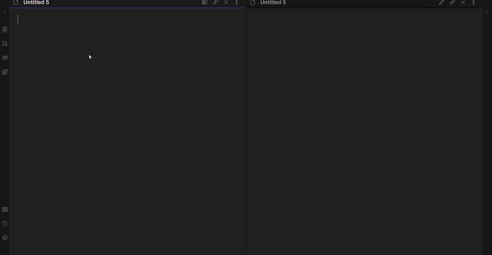

# obsidian-plotly
Obsidian plugin, which allow user to embed Plotly charts into markdown notes.

## Usage
Use double-click to add basic plotly template: 


## Examples
Plugin supports both JSON and YAML formats.
Those plots are identical:

```yaml
    ```plotly
    data:
    	- x: [0,1,2]
    	  y: [0,1,0]
    ```
```

```json
    ```plotly
    {
        "data": [{
            "x":[0, 1, 2],
            "y":[0, 1, 0]
        }]
    }
    ```
```
More examples on [Plotly](https://plotly.com/javascript/) official site.
