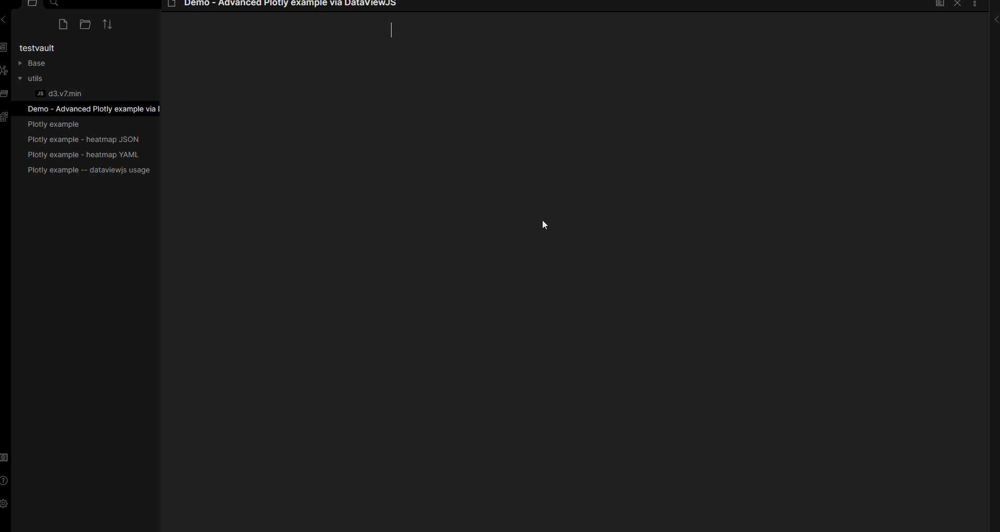
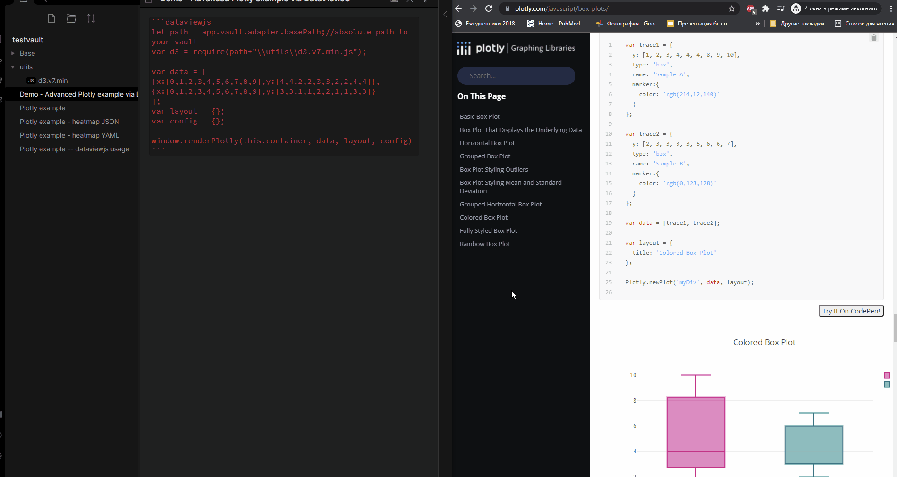

# obsidian-plotly
Obsidian plugin, which allow user to embed Plotly charts into markdown notes.

# Usage
## Basic (using plotly block)
Use Command Palette (`Ctrl-P`) to add basic plotly template: 


This approach allows you to create JSON or YAML inside `plotly` block 
with payload for data, layout and config objects. 
It does NOT support JavaScript examples from plotly.com site - it only support static payload forvarding to `Plotly.newPlot` function.
For JavaScript support use Advanced approach with DataViewJS.

Basic example (those YAML and JSON result in identical plots):
```yaml
    ```plotly
    data:
    	- x: [0,1,2]
    	  y: [0,1,0]
    ```
```

```json
    ```plotly
    {
        "data": [{
            "x":[0, 1, 2],
            "y":[0, 1, 0]
        }]
    }
    ```
```

## Advanced (using dataviewjs block)
Use Command Palette (`Ctrl-P`) to add plotly template: 


This approach DOES support any example from plotly.com. 
(I haven't checked them all, feel free to create issue if some aren't working).
However, this approach require DataView plugin to process JavaScript.
As a benefit, you can create plots based on data from you notes which you retrieve via DataView API!
(By the way, this sounds similar to what [obsidian-tracker](https://github.com/pyrochlore/obsidian-tracker) plugin does).

To use it, just add DataviewJS block with Plotly command, copy desired example and paste it.
NOTE: All examples use `Plotly.newPlot(component, data, layout, config)` to draw, and it takes some extra code to work in Obsidian.
There is a wrapper function available as `window.renderPlotly(this.component, data, layout, config)`, which will draw plot inside DataViewJS block.
(Wrapper parameters should be same as in example).

A lot of examples are on [Plotly](https://plotly.com/javascript/) official site.



NOTE: Some examples also require d3 library. This is large library and rarely needed. That's why I do not want to have it in plugin.
If you need this library, there is a workaround: you can download d3 library from official [site](https://d3js.org/d3.v7.min.js) (Open link->Right click->Save as...), place it in your vault and import using `require`; 

```js
    ```dataviewjs
        //Some plotly examples require d3 library to work.
        //Since it's large and used by few examples,
        //I propose a workaround to import d3;
        //You need to download dependency from https://d3js.org/d3.v7.min.js
        //and place it in your vault.
        let path = app.vault.adapter.basePath;//absolute path to your vault
        var d3 = require(path+"\\utils\\d3.v7.min.js");

        //Replace this block with any example from plotly.com
        //NOTE: `Plotly.newPlot` won't work here, use `window.renderPlotly` instead
        var data = [
            {x:[0,1,2,3,4,5,6,7,8,9],y:[4,4,2,2,3,3,2,2,4,4]},
            {x:[0,1,2,3,4,5,6,7,8,9],y:[3,3,1,1,2,2,1,1,3,3]}
        ];
        var layout = {title:"Example in DataViewJS"};
        var config = {displaylogo:false};

        window.renderPlotly(this.container, data, layout, config)
    ```
```

# Examples
Some more obsidian examples of this plugin [here](examples.md)

More examples on [Plotly](https://plotly.com/javascript/) official site.
